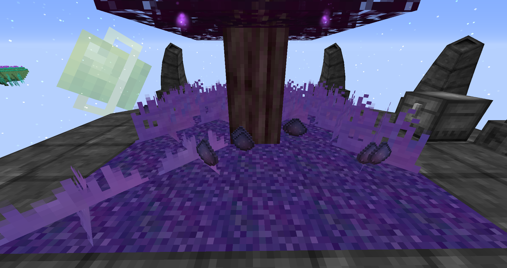
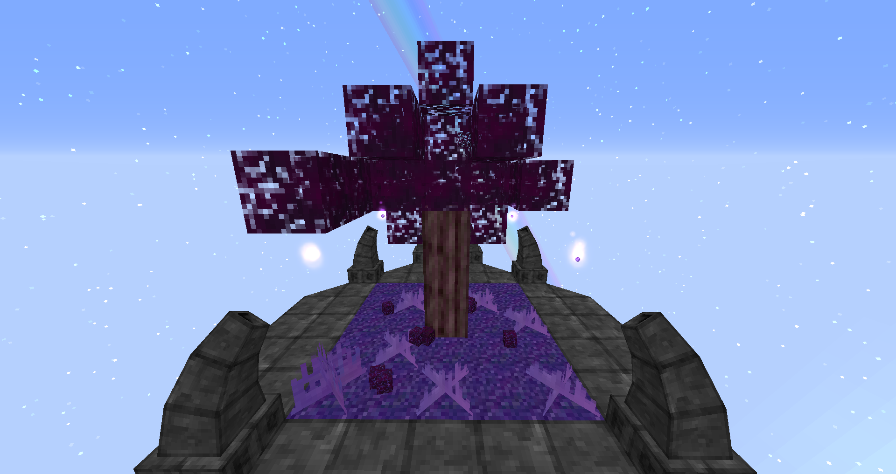
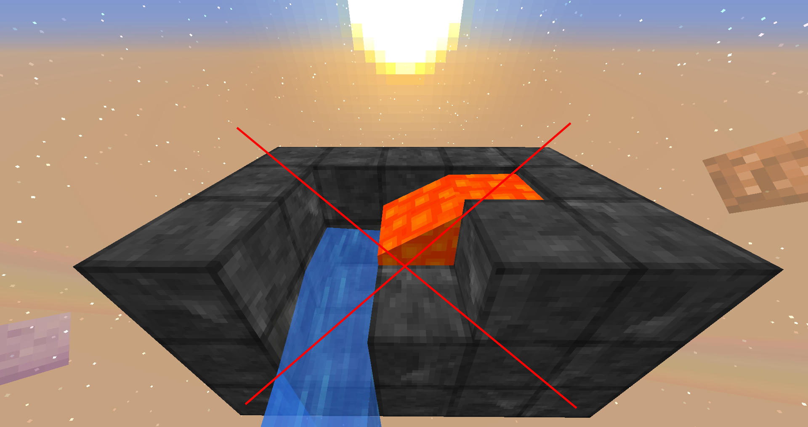
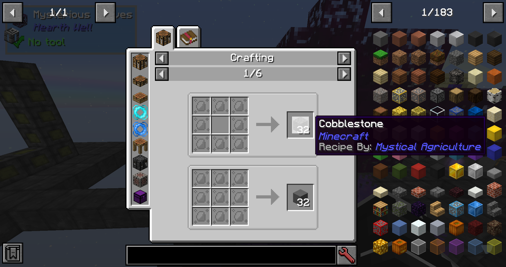
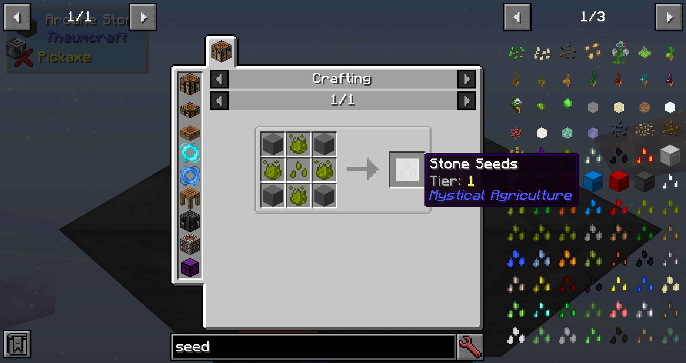
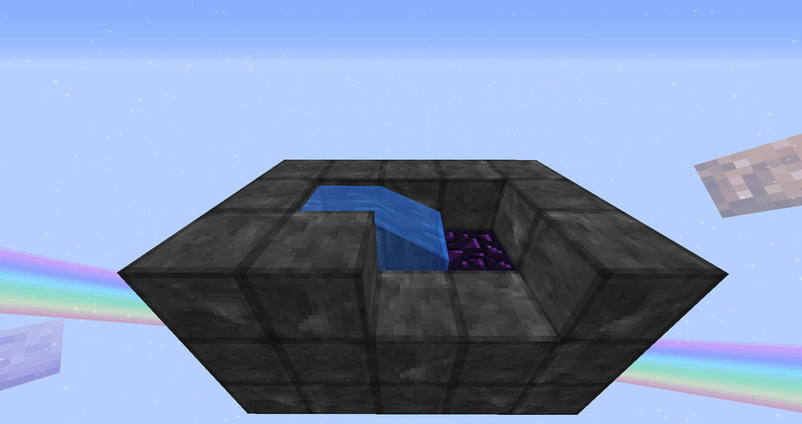
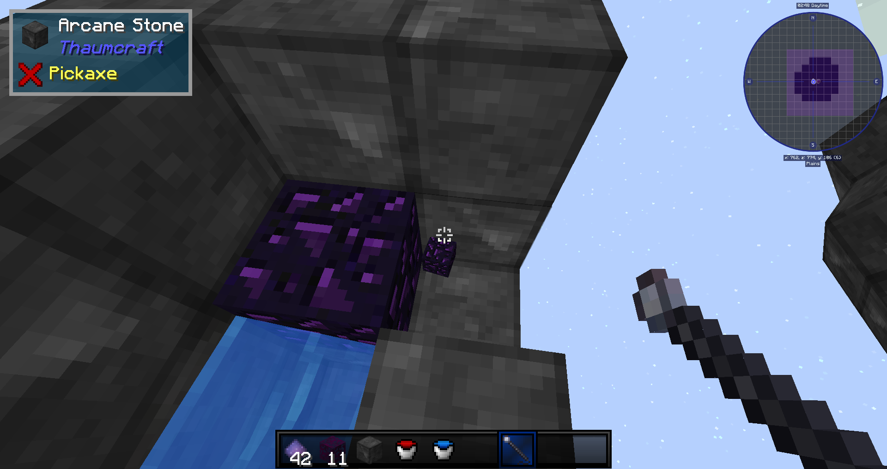

Getting Started

You can get Mysterious Dust by breaking the purple grass on your island.

You can get Mysterious Leaves simply by breaking them with your hands..

Cobblestone Generators are disabled.
You can no longer get free cobblestone by using that old vanilla mechanic.

You can get Stone by crafting stone essence crafted from Mysterious Dust.

Eventually you will need to craft yourself some Stone Seeds.

You can get Obsidian by multiple ways, one of them is to still placing Lava Next to water, it will transform the Lava into Obsidian.

You can pick up Obsidian blocks with the use of the Obsidian Displacer without the need of a diamond pickaxe.

