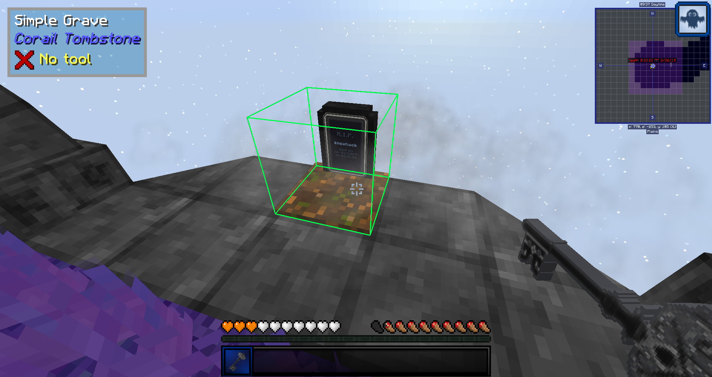
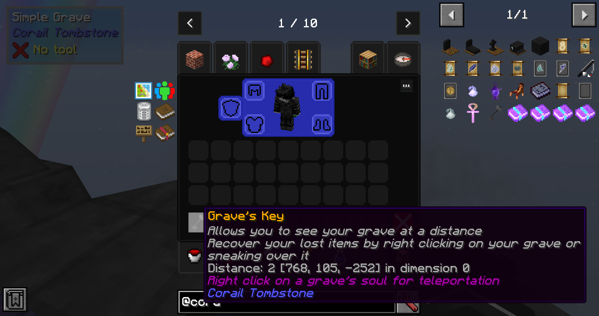

Graves:
When a player die, a grave will spawn at the exact location that the player died in the world. 
The grave will contain all the player's inventory items.

A Grave's Key will be giving to the player that contains the location of the grave.
