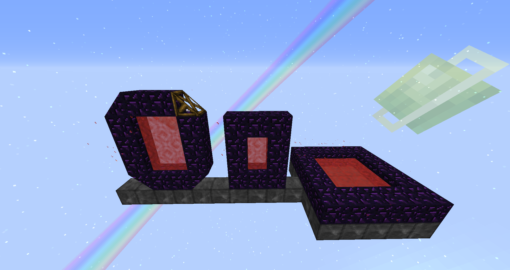
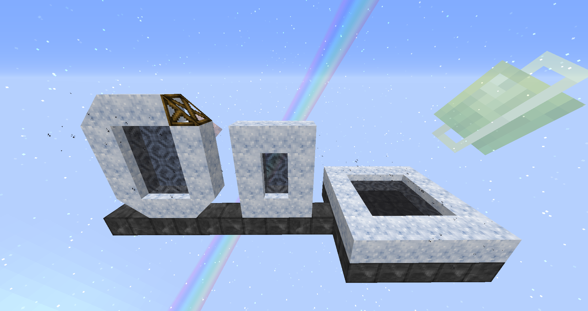
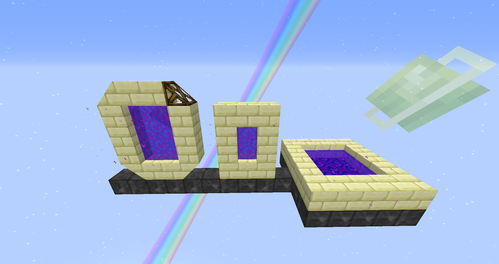

Portals

The Nether Portal:
The Nether portal can be made of any size using Obsidian blocks.
Warning: The corner of the portal frame can't be empty, you can use any block as a corner block including Slants.

The Midnight Portal:
The Midnight portal can be made of any size, but using Dreamrock blocks.
Warning: The corner of the portal frame can't be empty, you can use any block as a corner block including Slants.

The End Portal:
The End portal can be made of any size, but using End Stone Brick blocks.
Warning: The corner of the portal frame can't be empty, you can use any block as a corner block including Slants.
