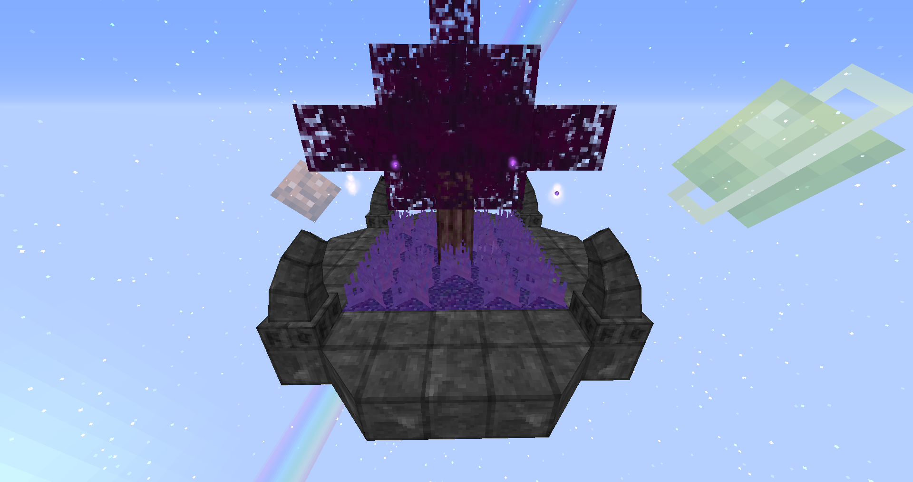

Starting Island

This is the default and only starting island, it is autocreated once a world load.
You can use the command "/teamislands myisland" to teleport to your island from any point.

Servers:
If you are on a server, you can create a new island by creating a new FTB Utilities from the FTB Utilities Team's menu.
You can invite players to your island simply by inviting them to your FTB Utilities Team, it will automatically teleport invited players once they join a team.

