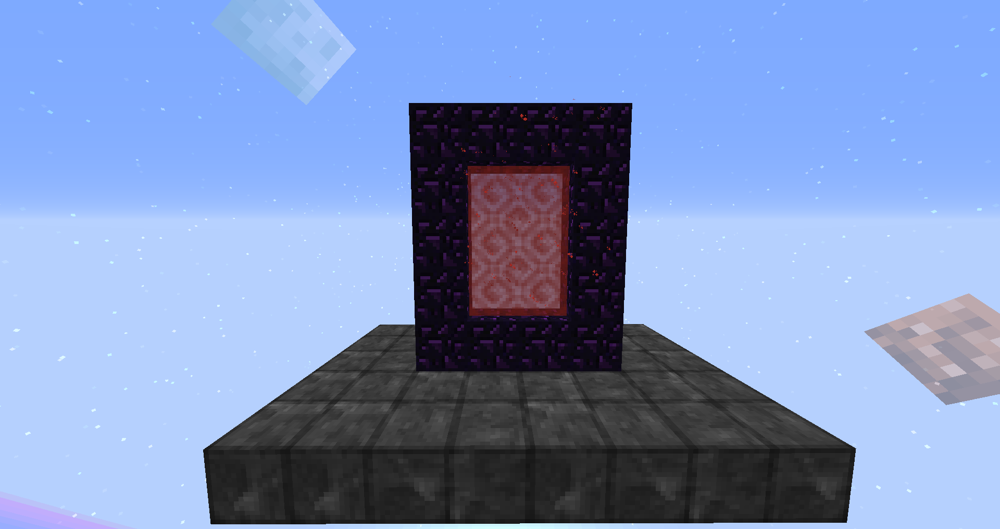
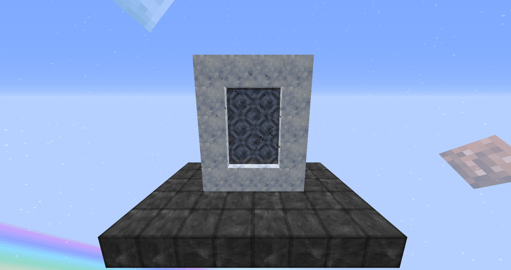
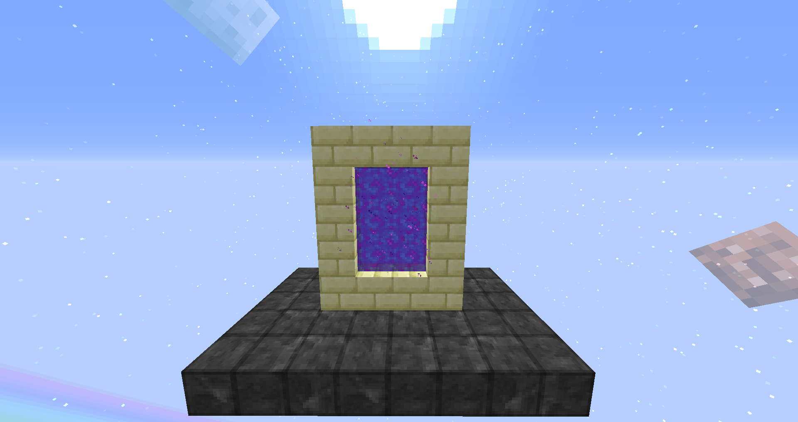

The Nether Portal:
Can be built like a normal Nether portal.
Warning: The corner blocks need to be the same as the rest of the frame, the corners can't be empty.

The Midnight Portal:
Can be built like a normal Nether portal but using Dreamrock blocks instead.
Warning: The corner blocks need to be the same as the rest of the frame, the corners can't be empty.

The End Portal:
Can be built like a normal Nether portal but using End Stone Brick blocks instead.
Warning: The corner blocks need to be the same as the rest of the frame, the corners can't be empty.
