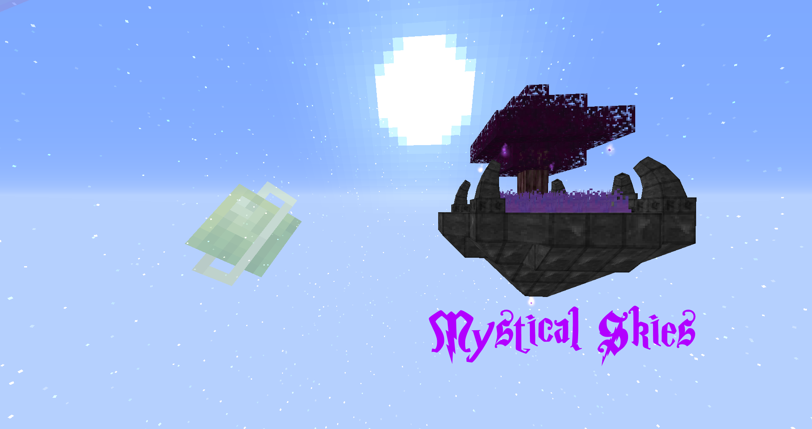

Welcome to Mystical Skies, a new mage age skyblock modpack.

Mystical Skies is a new take on a skyblock modpack that is magic themed and uses Hearth Well, a brand new magic themed resources mod.
This modpack is a progression based where you start in the void world then you have to travel to the Midnight dimension to be able to move to more advanced mods.
To move to end game you will need to Travel to the End Dimension and gather resources from there to finish the modpack. 

Resources Mod:
This Modpack uses Hearth Well as a early game resources mod, please visit its wiki website to learn more.
Hearth Well Wiki Link: https://wolforcept.github.io/hearthwell/
